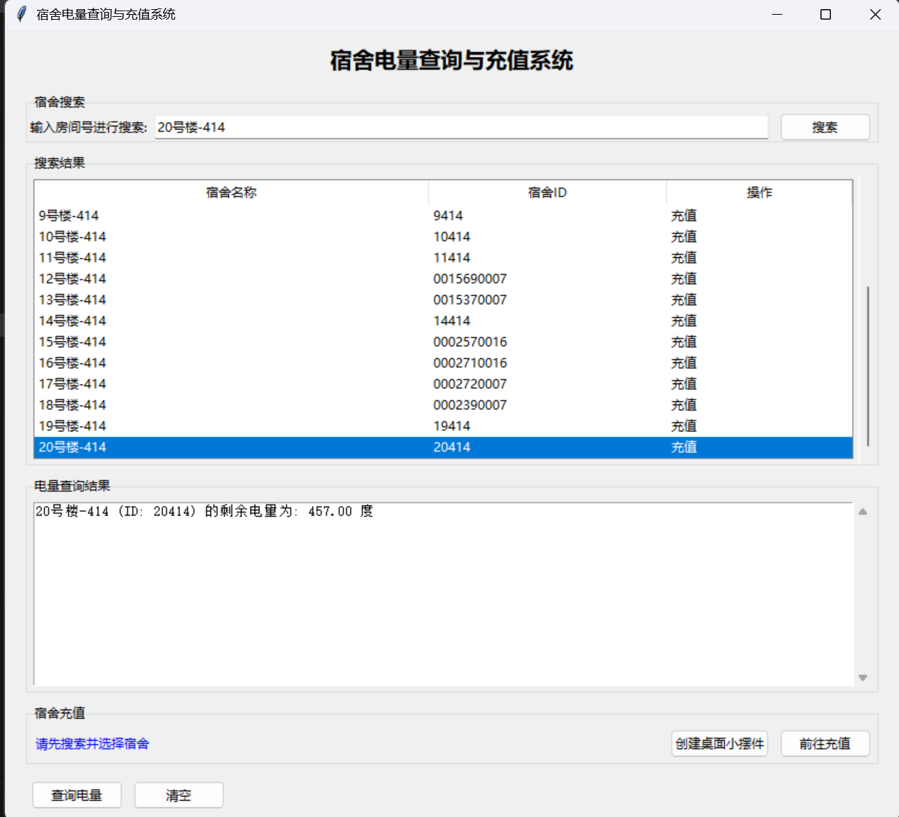
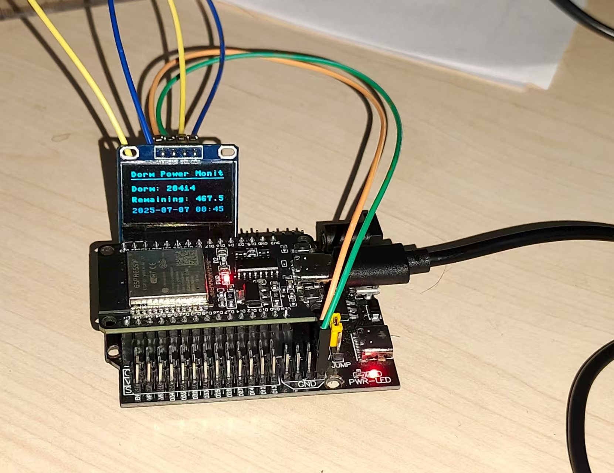
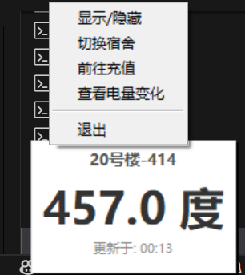

# XSYUDormPowerSpider

西安石油大学宿舍电量查询爬虫工具，通过自动化爬取宿舍编号对应电量数据，解决手动查询繁琐问题，实现电量信息快速获取与可视化监测。

## 项目背景

西安石油大学的同学们需要频繁登录小程序来查询宿舍的剩余电量，手动操作的流程不仅繁琐，还容易出现交错电费的情况。本项目利用爬虫技术自动化获取电量数据，并结合数据可视化与便捷功能，能够大幅提升查询效率，减少操作成本。

## 核心功能

### 1. 宿舍电量快速查询
用户只需输入宿舍编号，即可快速获取当天剩余电量。程序会根据输入的宿舍编号，自动从学校相关网站爬取对应宿舍的电量信息并展示给用户。

### 2. 耗电数据可视化监测
- **实时记录**：程序会实时记录每天的耗电数据，确保数据的及时性和准确性。
- **趋势展示**：自动生成耗电趋势折线图，让用户直观地了解宿舍的耗电情况，有助于合理规划用电。
- **历史回溯**：数据会存储至本地数据库（electricity_data.db），支持历史记录回溯，方便用户随时查看过去的用电数据。

### 3. 电费充值快捷入口
用户可以通过一键操作跳转至学校官方充值界面，无需再手动输入网址或进行复杂的查找，方便快捷地完成电费充值。

### 4. 一键生成桌面摆件
用户可以一键生成简洁方便的桌面摆件，该摆件会实时显示宿舍的电量信息，为用户提供更加便捷的电量查看方式，创造无限可能。

### 另外
我们还创意性的将电量显示移植到了esp32开发板上，使得宿舍电量能够实时显示在oled屏幕上


### 电量匮乏以及电量充足的时候桌面摆件显示不一样的颜色



## 爬虫模块

本项目的爬虫模块基于 Python 的`requests`与`BeautifulSoup`库实现网页解析。`requests`库用于发送 HTTP 请求，获取学校电量查询页面的 HTML 内容；`BeautifulSoup`库则用于解析 HTML 内容，提取出所需的电量信息。

## 硬件交互模块

- **主控芯片**：ESP32，一款高性能、低功耗的微控制器，具有强大的计算能力和丰富的外设接口。
- **编程语言**：MicroPython，一种精简的 Python 实现，使得开发者可以使用 Python 语言来编写 ESP32 的程序，降低了开发难度。
- **显示设备**：OLED 屏幕，用于实时显示宿舍的电量信息，具有高对比度、低功耗等优点。
- **通信方式**：Wi-Fi，ESP32 通过 Wi-Fi 与爬虫程序进行数据交互，确保电量信息的实时更新。

## 项目结构

```plaintext
XSYUDormPowerSpider/
├── dormitory_electricity/
│   ├── main_app.py          # 主程序，实现电量查询与充值系统的界面和逻辑
│   ├── widget.py            # 桌面小摆件程序，实时显示宿舍电量
│   ├── database.py          # 数据库操作模块，用于获取电量记录
│   ├── 文件结构.py          # 生成项目文件结构的脚本
│   ├── utils.py             # 工具函数模块，包含打开主程序和充值页面的函数
│   ├── dorm_rooms_2025.csv  # 宿舍信息文件，包含宿舍编号、名称等信息
│   └── selected_dorm.cfg    # 配置文件，记录已选择的宿舍信息
├── img/
│   └── 展示1.png            # ESP32实时显示宿舍电量的展示图片
├── LICENSE                  # 项目许可证文件
├── requirements.txt         # Python依赖文件
└── README.md                # 项目说明文档
```

## 项目作者

- **机械师**
  - 职责：负责爬虫核心开发、逻辑优化、数据库设计以及 Windows 桌面程序开发（exe 封装）。
- **LaplaceHe**
  - 职责：完成爬虫初始逻辑的编写、ESP32 单片机程序的开发以及 Android APP 框架的搭建。


## 使用指南

### 1. 环境部署

```bash
# 克隆仓库
git clone https://github.com/LaplaceMeo/XSYUDormPowerSpider.git
cd XSYUDormPowerSpider


# 安装Python依赖
pip install -r requirements.txt
```


### 2. 运行程序
运行`dormitory_electricity/main_app.py`文件，启动宿舍电量查询与充值系统。在界面中输入宿舍编号进行搜索，即可查看宿舍的电量信息，并进行充值等操作。

### 3. 生成桌面摆件
在主程序界面中，选择宿舍后，点击 “创建桌面小摆件” 按钮，即可生成实时显示宿舍电量的桌面摆件。

### 4. ESP32 硬件配置
将 ESP32 开发板连接到电源和 Wi-Fi 网络，上传 MicroPython 程序(DormElectrics.py)到 ESP32，确保其能够与爬虫程序进行数据交互。

## 联系方式

如有问题或合作需求，可通过以下方式联系：

- 机械师 QQ：2126319400
- LaplaceHe QQ：2590979868

##
欢迎大家Fork本项目

# 鸣谢

非常感谢黄少政学长（QQ: 158482852）的支持与鼓励，他主导了本次重大更新，对项目的UI设计、核心功能、代码质量和开发流程进行了全面的优化和重构。

非常感谢dr1am1(QQ: 376742095)对本项目的支持，提供了Linux自动化部署版本

## 许可证

MIT License