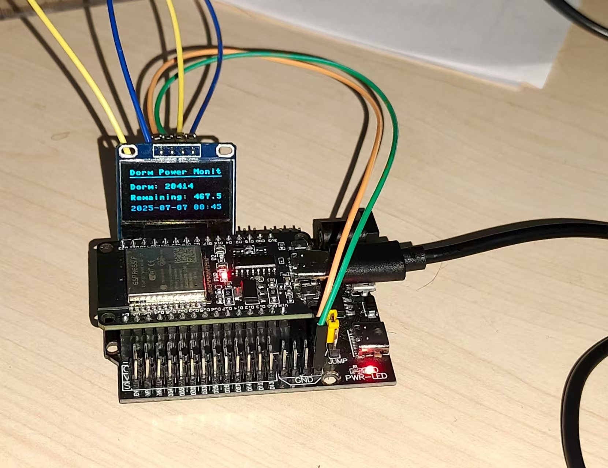

# XSYUDormPowerSpider

西安石油大学宿舍电量查询爬虫工具，通过自动化爬取宿舍编号对应电量数据，解决手动查询繁琐问题，实现电量信息快速获取与可视化监测。

**最新更新：v2.0 全新升级！** 现已支持更智能的模糊搜索、个性化主题切换和历史用电可视化功能！

## 核心功能

### 1. 宿舍电量快速查询
- **智能模糊搜索**：采用 `thefuzz` 库，即使输入不完整的宿舍信息（如“1-101”），也能快速准确地匹配到目标宿舍（如“1号楼-101”）。
- **实时电量获取**：只需双击搜索结果，即可立即查询并显示当前剩余电量。

*(这里可以替换为新版查询界面的截图)*

### 2. 耗电数据可视化监测
- **历史用电趋势**：新增“查看历史用电”功能，一键生成过去30天的电量消耗折线图，帮助你直观分析用电习惯。
- **每日数据记录**：程序会自动记录每日的电量数据到本地数据库，方便长期追踪。

*(这里可以替换为历史用电图表的截图)*

### 3. 个性化与便捷体验
- **多款主题切换**：内置 `ttkbootstrap` 提供的超过10款精美主题（包含深色模式），可在“主题”菜单中随时切换，定制你的专属界面。
- **配置自动保存**：应用会自动记住你选择的主题以及窗口的大小和位置，下次打开时无需重新设置。
- **快捷充值入口**：选中宿舍后，一键跳转至学校官方充值页面。

### 4. 一键生成桌面摆件
用户可以一键生成简洁方便的桌面摆件，该摆件会实时显示宿舍的电量信息，为用户提供更加便捷的电量查看方式，创造无限可能。

### 另外
我们还创意性的将电量显示移植到了esp32开发板上，使得宿舍电量能够实时显示在oled屏幕上


## 项目结构

```plaintext
XSYUDormPowerSpider/
├── v1.0/
│   ├── main_app.py          # 主程序，实现界面和核心逻辑
│   ├── scraper.py           # 爬虫模块，负责获取电量数据
│   ├── database.py          # 数据库模块，负责存储和读取用电记录
│   ├── config.py            # 配置管理模块，负责读写用户设置
│   ├── widget.py            # 桌面小摆件程序
│   ├── dorm_rooms_2025.csv  # 宿舍信息文件
│   └── ...
├── img/
│   └── ...
├── LICENSE
├── requirements.txt         # Python依赖文件
└── README.md                # 项目说明文档
```

## 使用指南

### 1. 环境部署

```bash
# 克隆仓库
git clone https://github.com/shaozheng0503/XSYUDormPowerSpider.git
cd XSYUDormPowerSpider/XSYUDormPowerSpider-main

# (推荐) 创建并激活虚拟环境
python -m venv venv
# Windows
venv\Scripts\activate
# macOS / Linux
source venv/bin/activate

# 安装Python依赖
pip install -r requirements.txt
```

### 2. 运行程序
运行 `v1.0/main_app.py` 文件，启动宿舍电量查询与充值系统。
```bash
python v1.0/main_app.py
```

在界面中输入宿舍编号进行搜索，即可查看宿舍的电量信息，并进行充值、查看历史等操作。

## 项目作者

- **机械师**
  - 职责：负责爬虫核心开发、逻辑优化、数据库设计以及 Windows 桌面程序开发（exe 封装）。
- **LaplaceHe**
  - 职责：完成爬虫初始逻辑的编写、ESP32 单片机程序的开发以及 Android APP 框架的搭建。
- **shaozheng0503 (贡献者)**
  - 职责：v2.0版本重构，实现模块化、界面美化、主题切换、历史数据可视化等功能。

## 联系方式

如有问题或合作需求，可通过以下方式联系：

- 机械师 QQ：2126319400
- LaplaceHe QQ：2590979868

##
欢迎大家Fork本项目

## 许可证

MIT License